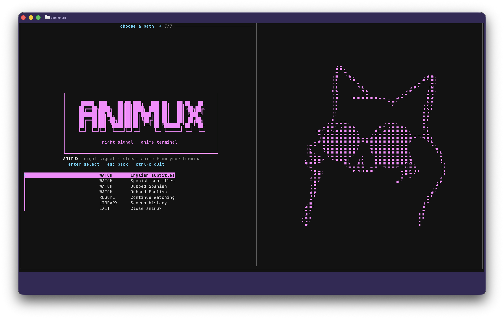
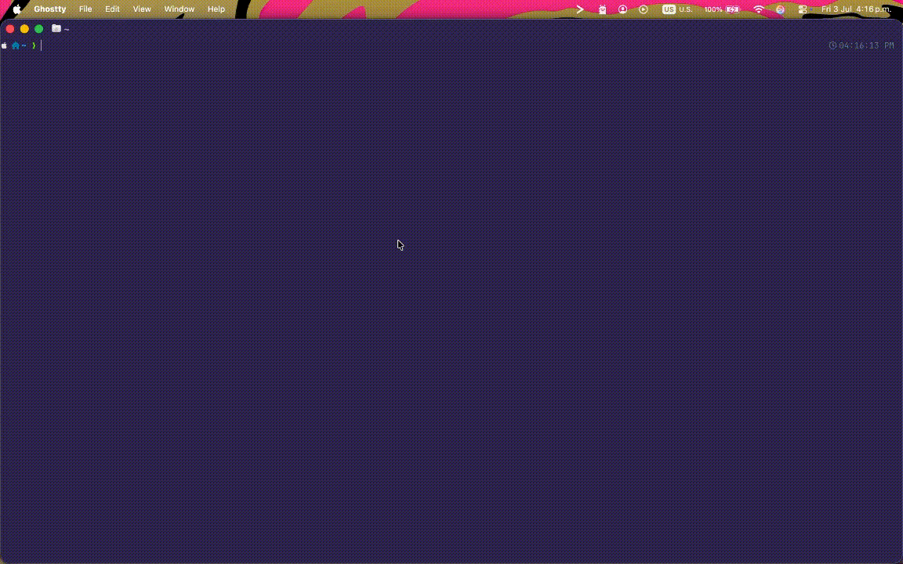
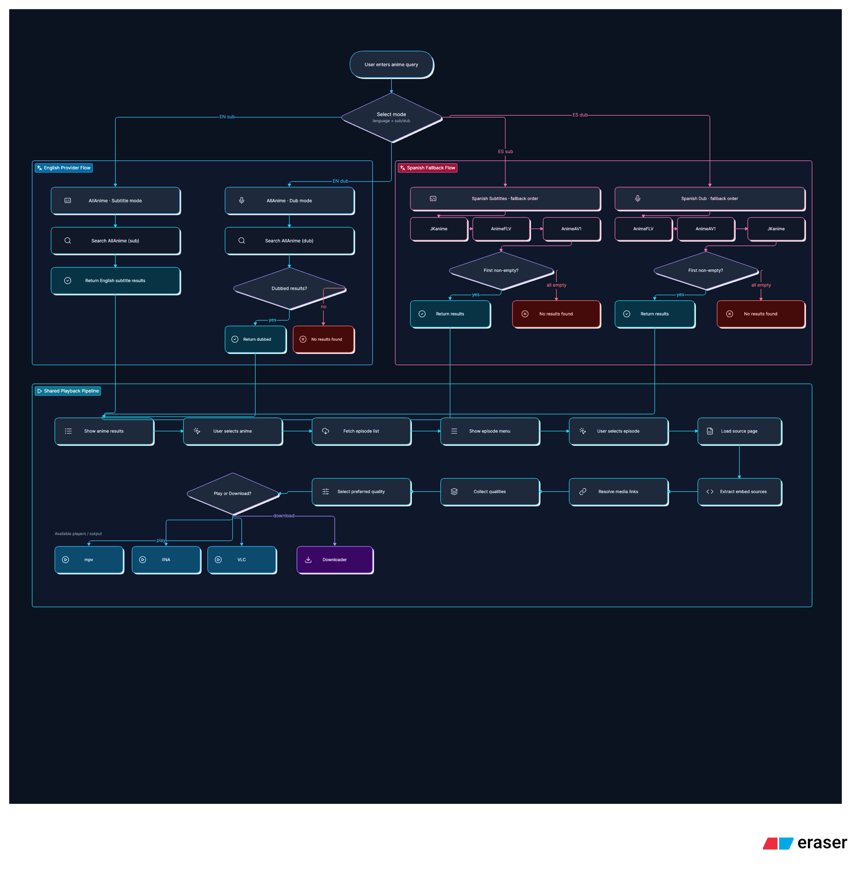

# Animux

A polished terminal anime browser/player with English and Spanish modes, source fallback, keyboard navigation, cover previews, and macOS/Linux-friendly playback.

Animux is a customized and extended project originally based on [pystardust/ani-cli](https://github.com/pystardust/ani-cli). It keeps the same GPL-3.0 license while adding its own interface, source routing, Spanish subtitle/dub support, extractor-backed fallback behavior, and quality-of-life improvements.

> Animux does not host, upload, or distribute media files. It only provides a terminal interface for browsing and opening publicly available sources.

## Preview





---

## Features

* Terminal-first anime browser/player
* English subtitle mode
* Spanish subtitle mode
* Dub mode where available
* Sequential Spanish source fallback
* Interactive `fzf` TUI
* Keyboard-first navigation
* Back navigation with `Esc`
* Continue watching / history support
* HD cover previews in episode menus
* Random bundled ASCII art in the main menu
* macOS and Linux support
* POSIX shell entrypoint
* Python-backed internal extractor for Spanish sources
* Installer and uninstaller scripts

---

## Source routing

Animux automatically chooses the best internal source based on the selected mode.

### English subtitles

English subtitle mode uses the English provider flow.

```text
English subtitles → AllAnime
```

### Spanish subtitles

Spanish subtitle search uses sequential fallback. Animux stops at the first source that returns results.

```text
Spanish subtitles → JKanime → AnimeFLV → AnimeAV1
```

### Dub mode

Dub search prioritizes sources more likely to expose dubbed entries first.

```text
Dub mode → AnimeFLV → AnimeAV1 → JKanime
```

This avoids duplicate search entries and keeps the result list focused.

---

## How it works

```text
Search query
    ↓
Mode selection
    ↓
Provider/source routing
    ↓
Anime results
    ↓
Episode list
    ↓
Episode selection
    ↓
Embed/source extraction
    ↓
Quality selection
    ↓
Playback or download
```

For a more detailed scraping overview, see the flow diagram:

```md

```

---

## Requirements

Animux requires:

* `curl`
* `fzf`
* `mpv`
* `ffmpeg`
* `perl`
* `openssl`
* `python3`

Optional:

* `chafa` for richer terminal image previews
* `ani-skip` for intro skipping with `mpv`
* `iina-cli` if using IINA on macOS

### macOS

Install dependencies with Homebrew:

```sh
brew install curl fzf mpv ffmpeg perl openssl python chafa
```

IINA users should install IINA separately and make sure `iina-cli` is available.

---

## Install

### One-command install

```sh
curl -fsSL https://raw.githubusercontent.com/MarcoAnotino/animux/main/install.sh | sh
```

### Install from source

```sh
git clone https://github.com/MarcoAnotino/animux.git
cd animux
./install.sh
```

### Local install without sudo

```sh
PREFIX="$HOME/.local" ./install.sh
```

Add the local binary directory to your shell configuration if needed:

```sh
export PATH="$HOME/.local/bin:$PATH"
```

The installer automatically selects a suitable prefix:

* `/opt/homebrew` on Apple Silicon when available
* `/usr/local` when writable
* `$HOME/.local` as a fallback

Any explicit `PREFIX` is respected.

---

## Usage

Start the interactive menu:

```sh
animux
```

Search with Spanish subtitles:

```sh
animux -L es "one piece"
```

Search with English subtitles:

```sh
animux -L en "demon slayer"
```

Continue watching from history:

```sh
animux -c
```

Request dubbed media where available:

```sh
animux --dub -L es "dragon ball"
```

Select a specific result and episode:

```sh
animux -L es -S 1 -e 1 "frieren"
```

Download instead of play:

```sh
animux -d -L es "one piece"
```

---

## Options

```text
-L, --language en|es        Select subtitle language
-P, --provider PROVIDER     Force an internal provider
-S, --select-nth INDEX      Select the nth search result
-e, --episode EPISODE       Select an episode or episode range
-r, --range RANGE           Select an episode range
-q, --quality QUALITY       Preferred stream quality
-c, --continue              Continue from watch history
-d, --download              Download instead of playing
-D, --delete                Delete history
-l, --logview               Show logs
-v, --vlc                   Use VLC
-V, --version               Show version
-h, --help                  Show help
    --dub                   Request dubbed media
    --rofi                  Use rofi instead of fzf
    --dmenu                 Use dmenu instead of fzf
    --skip                  Enable intro skipping with mpv
    --no-detach             Keep the player attached
    --exit-after-play       Exit after playback
```

Run the full help page:

```sh
animux --help
```

---

## Keyboard controls

```text
Enter    Select
Esc      Back
Ctrl+C   Quit
Tab      Multi-select
```

---

## Provider override

Most users do not need this. Animux chooses a source automatically based on the selected language/mode.

```sh
animux -P allanime -L en "frieren"
animux -P python-extractor -L es "one piece"
```

Legacy provider aliases are kept for compatibility where possible.

---

## Configuration

Animux uses the `ANIMUX_*` environment namespace.

Common variables:

```text
ANIMUX_PROVIDER
ANIMUX_PLAYER
ANIMUX_DOWNLOAD_DIR
ANIMUX_QUALITY
ANIMUX_LOG
ANIMUX_HIST_DIR
ANIMUX_LIBEXEC_DIR
ANIMUX_SHARE_DIR
ANIMUX_BUILTIN_ART
ANIMUX_ASCII_ART
ANIMUX_ASCII_ART_DIR
ANIMUX_RANDOM_ASCII_ART
ANIMUX_NO_HEADER
ANIMUX_HEADER
ANIMUX_EPISODE_ART
ANIMUX_EPISODE_ART_SIZE
```

Legacy `ANI_CLI_*` variables are also supported as fallbacks for compatibility with existing setups.

Example:

```sh
ANIMUX_PLAYER=debug animux -L es -S 1 -e 1 "one piece"
```

Legacy example:

```sh
ANI_CLI_PLAYER=debug animux -L es -S 1 -e 1 "one piece"
```

---

## Data locations

History is stored at:

```text
${XDG_STATE_HOME:-$HOME/.local/state}/animux/ani-hsts
```

Cached art is stored at:

```text
${XDG_CACHE_HOME:-$HOME/.cache}/animux
```

On first use, Animux can copy an existing `ani-cli/ani-hsts` history file when the new Animux history file does not exist. The original history file is not removed.

---

## Installed layout

```text
$PREFIX/bin/animux
$PREFIX/libexec/animux/anime-extractor
$PREFIX/libexec/animux/extractor.py
$PREFIX/share/animux/menuPixelArt.txt
$PREFIX/share/animux/asciiArt.txt
$PREFIX/share/animux/ascii/*.txt
$PREFIX/share/man/man1/animux.1
```

In a source checkout, bundled ASCII art lives in:

```text
assets/ascii/
```

---

## ASCII art

Animux ships with a small collection of ASCII art files for the main menu. By default, one is selected randomly on each run.

Disable random art:

```sh
ANIMUX_RANDOM_ASCII_ART=0 animux
```

Use a custom art file:

```sh
ANIMUX_ASCII_ART=/path/to/art.txt animux
```

Use a custom art directory:

```sh
ANIMUX_ASCII_ART_DIR=/path/to/ascii animux
```

Disable remote art:

```sh
ANIMUX_REMOTE_ART=0 animux
```

Disable episode cover previews:

```sh
ANIMUX_EPISODE_ART=0 animux
```

---

## Development

Run Animux directly from a source checkout:

```sh
./animux
```

Run basic validation:

```sh
make check
```

Validate Python extractor files:

```sh
python3 -m py_compile extractor.py test_spanish_sources.py
python3 test_spanish_sources.py
```

Run extractor tests:

```sh
python3 -m unittest test_animeflv_extractor.py test_extractor.py
```

No Bash-specific shell features are required for the main entrypoint.

---

## Uninstall

### One-command uninstall

```sh
curl -fsSL https://raw.githubusercontent.com/MarcoAnotino/animux/main/uninstall.sh | sh
```

### Uninstall from source

```sh
./uninstall.sh
```

Use the same `PREFIX` supplied during installation if you installed to a custom prefix.

Cache and history are intentionally preserved.

---

## Credits

Animux is based on [pystardust/ani-cli](https://github.com/pystardust/ani-cli), licensed under GPL-3.0.

This project started from that foundation and has been modified with:

* redesigned terminal interface
* improved interactive navigation
* language-first mode selection
* Spanish subtitle support
* dub mode support where available
* sequential Spanish source fallback
* extractor-backed Spanish provider routing
* HD cover previews
* bundled ASCII art support
* install/uninstall flow improvements
* macOS/Linux packaging improvements

Thanks to the original `ani-cli` project and its contributors for the foundation that made this project possible.

See [LICENSE](LICENSE) for the full GPL-3.0 license text.

---

## License

Animux is distributed under the GNU General Public License v3.0.

Because this project is based on `ani-cli`, it keeps the same license and includes attribution to the original project.

---

## Legal disclaimer

Animux does not host, upload, store, or distribute media files.

It is a terminal interface for browsing and opening publicly available sources. Users are responsible for complying with applicable laws and the terms of service of any websites or providers they access.

Animux is not affiliated with, endorsed by, or officially connected to any anime provider, streaming website, or media distributor.
